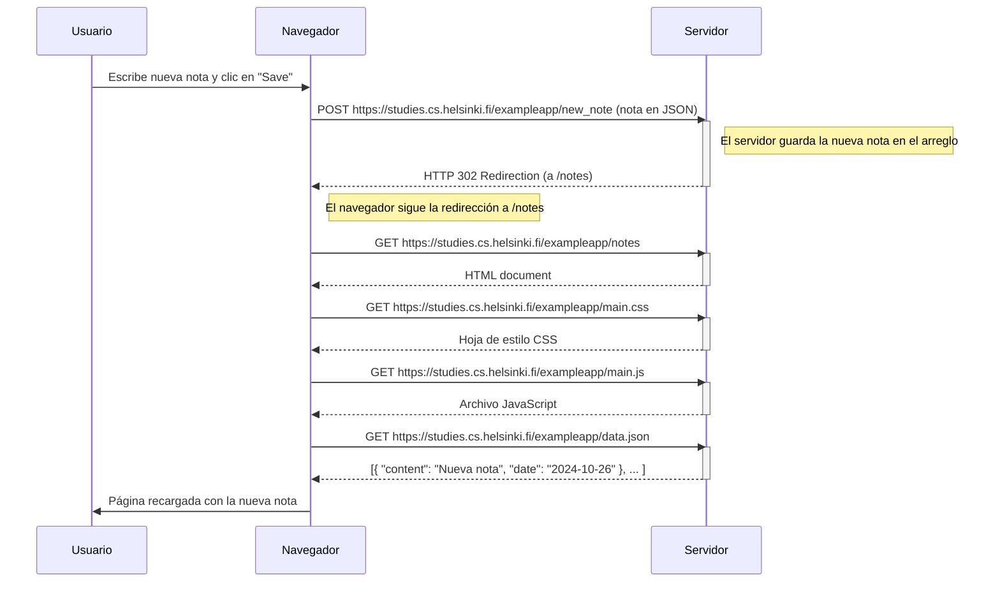

#Diagrama de nueva nota

```mermaid

sequenceDiagram
    participant user as Usuario
    participant browser as Navegador
    participant server as Servidor

    user->>browser: Escribe nueva nota y clic en "Save"
    
    browser->>server: POST https://studies.cs.helsinki.fi/exampleapp/new_note (nota en JSON)
    activate server
    Note right of server: El servidor guarda la nueva nota en el arreglo

    server-->>browser: HTTP 302 Redirection (a /notes)
    deactivate server

    Note right of browser: El navegador sigue la redirección a /notes
    
    browser->>server: GET https://studies.cs.helsinki.fi/exampleapp/notes
    activate server
    server-->>browser: HTML document
    deactivate server

    browser->>server: GET https://studies.cs.helsinki.fi/exampleapp/main.css
    activate server
    server-->>browser: Hoja de estilo CSS
    deactivate server

    browser->>server: GET https://studies.cs.helsinki.fi/exampleapp/main.js
    activate server
    server-->>browser: Archivo JavaScript
    deactivate server

    browser->>server: GET https://studies.cs.helsinki.fi/exampleapp/data.json
    activate server
    server-->>browser: [{ "content": "Nueva nota", "date": "2024-10-26" }, ... ]
    deactivate server

    browser->>user: Página recargada con la nueva nota

```