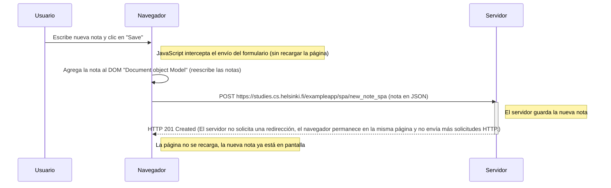

# Diagrama de Creación de nueva nota en la Aplicación de una Sola Página

```mermaid
sequenceDiagram
    participant user as Usuario
    participant browser as Navegador
    participant server as Servidor

    user->>browser: Escribe nueva nota y clic en "Save"
    
    Note right of browser: JavaScript intercepta el envío del formulario (sin recargar la página)

    browser->>browser: Agrega la nota al DOM "Document object Model" (reescribe las notas)

    browser->>server: POST https://studies.cs.helsinki.fi/exampleapp/spa/new_note_spa (nota en JSON)
    activate server
    Note right of server: El servidor guarda la nueva nota

    server-->>browser: HTTP 201 Created (El servidor no solicita una redirección, el navegador permanece en la misma página y no envía más solicitudes HTTP.)
    deactivate server

    Note right of browser: La página no se recarga, la nueva nota ya está en pantalla
```