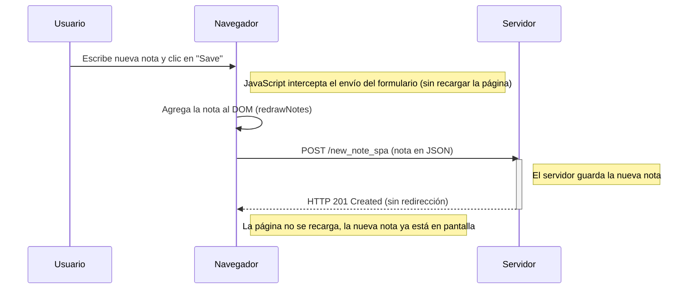

# Diagrama de la Aplicación de una Sola Página

```mermaid
sequenceDiagram
    participant user as Usuario
    participant browser as Navegador
    participant server as Servidor

    user->>browser: Escribe nueva nota y clic en "Save"
    
    Note right of browser: JavaScript intercepta el envío del formulario (sin recargar la página)

    browser->>browser: Agrega la nota al DOM (redrawNotes)

    browser->>server: POST /new_note_spa (nota en JSON)
    activate server
    Note right of server: El servidor guarda la nueva nota

    server-->>browser: HTTP 201 Created (sin redirección)
    deactivate server

    Note right of browser: La página no se recarga, la nueva nota ya está en pantalla
```