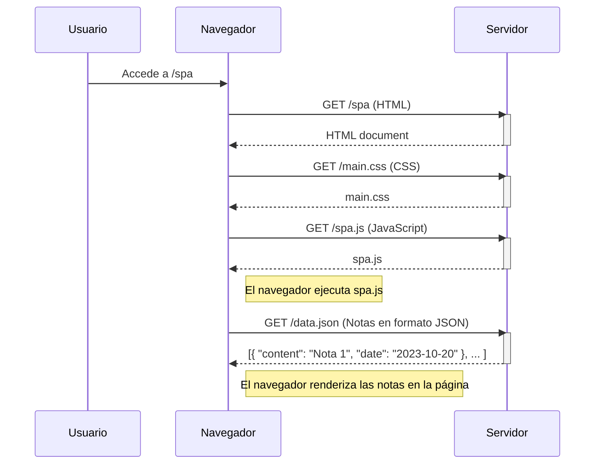

# Diagrama de acceso a la Aplicación de una Sola Página

```mermaid
sequenceDiagram
    participant user as Usuario
    participant browser as Navegador
    participant server as Servidor

    user->>browser: Accede a /spa
    browser->>server: GET /spa (HTML)
    activate server
    server-->>browser: HTML document
    deactivate server

    browser->>server: GET /main.css (CSS)
    activate server
    server-->>browser: main.css
    deactivate server

    browser->>server: GET /spa.js (JavaScript)
    activate server
    server-->>browser: spa.js
    deactivate server

    Note right of browser: El navegador ejecuta spa.js

    browser->>server: GET /data.json (Notas en formato JSON)
    activate server
    server-->>browser: [{ "content": "Nota 1", "date": "2023-10-20" }, ... ]
    deactivate server

    Note right of browser: El navegador renderiza las notas en la página

```